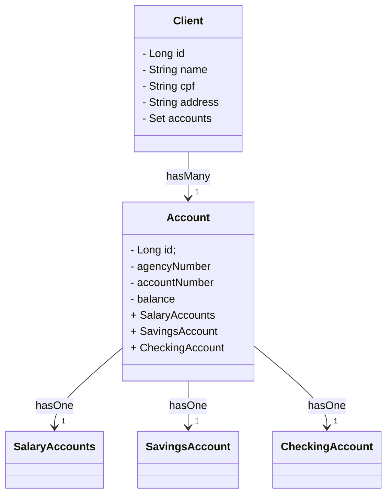

<h1 align="center">
 DESAFIO DIO MODELAGEM DE BANCO PARA DIO
 <h3 align ="center" >Projeto de modelagem de backend de simulação de aplicação bancária para DIO ☕</h3> 
</h1>

### 📕 SOBRE 
<h4>Desafio da DIO de modelagem  de backend de uma aplicação simulação de banco</h4>

### 🧜‍♀️ **DIAGRAMA(Mermaid)**: 

    

    ### 🔨 FERRAMENTAS UTILIZADAS

- [**JAVA**](https://docs.oracle.com/en/java/)
- [**SPRING BOOT**](https://docs.spring.io/spring-boot/index.html)
- [**GIT**](https://git-scm.com/doc)
- [**GITHUB**](https://docs.github.com/pt)
- [**H2**](https://www.h2database.com/html/main.html)
- [**POSTGRESQL**](https://www.h2database.com/html/main.html)
- [**SWAGGER**](https://swagger.io/docs/)
- [**POSTMAN**](https://learning.postman.com/docs/introduction/overview/)

### 👁‍🗨 OS MICROSERVIÇOS ESTARÃO DISPONÍVEIS NAS SEGUINTES URLS

- **hr-worker**: http://localhost:8080/client
- **hr-payroll**: http://localhost:8080/account

#### 🔗 LINKS PARA ACESSO DO SWAGGER
-[SWAGGER FUNCIONÁRIOS](http://localhost:8080/swagger-ui/index.html)

-[SWAGGER PAGAMENTOS](http://localhost:8080/swagger-ui/index.html)

#### 📃 IMAGENS ILUSTRATIVAS SWAGGER

 
 
 
 

 
 
 

